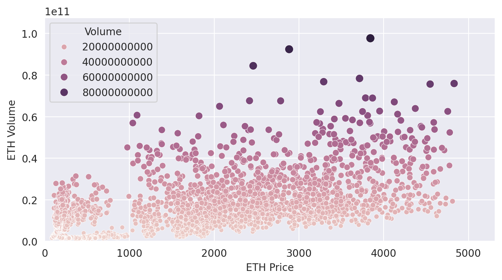
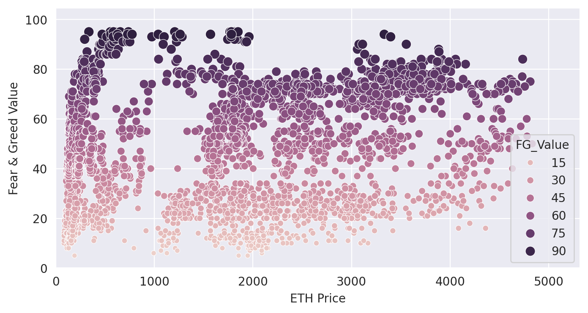
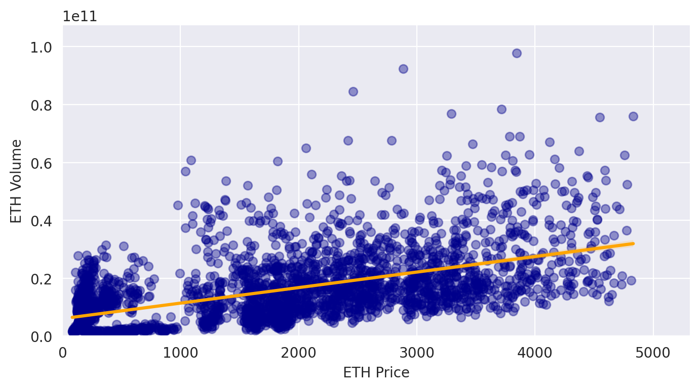
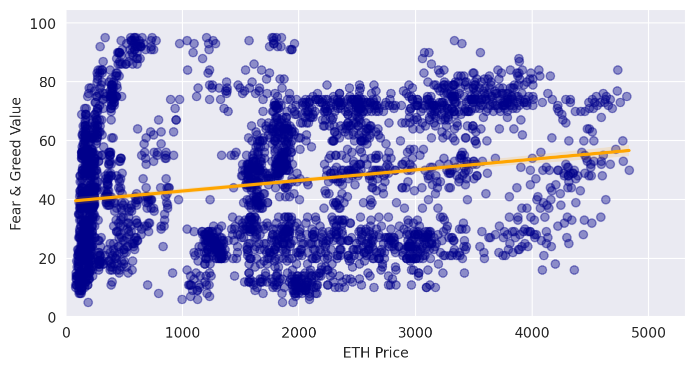

# ETH Price Analysis: Volume & Fear/Greed as Explanatory Variables

## Motivation

In late 2023 and early 2024, during the latest major crypto market bull run, several major cryptocurrencies reached new all-time highs (ATH), including BTC and SOL. Ethereum (ETH) also reached a new ATH, but unlike many other major cryptocurrencies, it struggled to move significantly beyond its previous peak before the market turned downward.

Since I had recently been working with pandas, matplotlib, and scikit-learn to visualize, estimate, and analyze data, I came up with an idea that I wanted to test using ETH. I wanted to examine whether two variables that might have a relationship with the ETH market could help explain variation in ETH's price, either individually or when used together.

The two variables I chose were ETH trading volume and the Crypto Fear & Greed Index.

I could have used BTC price as an explanatory variable to estimate ETH price. However, major cryptocurrencies often move in similar directions, particularly over longer periods, which could result in a highly correlated relationship. Instead, I chose ETH trading volume and the Fear & Greed Index, which has been available since early 2018.

## Data Sources

* **ETH price & volume** — [yfinance](https://pypi.org/project/yfinance/), 2018–2026
* **Fear & Greed Index** — [alternative.me](https://alternative.me/crypto/fear-and-greed-index/) API, same date range

## Repo Structure

```text
Code/    → data collection, cleaning, and analysis scripts
Data/    → cleaned/merged CSV data
Graphs/  → scatter plots and regression plots
```

## Tools Used

pandas, matplotlib, seaborn, scikit-learn (`LinearRegression`, `train_test_split`)

## Analysis

First, I retrieved the ETH price and volume data using yfinance and the Fear & Greed data using the Alternative.me API. I then used pandas to save the data as CSV files, clean and rename the columns, remove unnecessary data and missing values, and merge the datasets by date.

### Scatter Plots

I first created two scatter plots: one comparing ETH price with trading volume and another comparing ETH price with the Fear & Greed Index.



The volume-price plot shows a positive relationship between ETH price and trading volume. As ETH price increases, higher trading volumes become more common, while the lower range of observed volume also tends to increase. However, the relationship is relatively dispersed.



The Fear & Greed plot shows much more dispersion. A wide range of Fear & Greed values can occur across different ETH price levels, and no clear linear relationship is visible from the scatter plot alone.

### Regression Plots

I then added linear regression lines to the same variable pairs to better visualize how the observations are distributed around the fitted line.



For the price-volume relationship, the observations are distributed around a positively sloped regression line, suggesting a stronger linear relationship than the Fear & Greed-price relationship.



For ETH price and Fear & Greed, the observations are much more widely dispersed around the regression line, suggesting that a simple linear model does not describe their relationship particularly well.

### Regression Results

I first fitted a multiple linear regression using both Volume and Fear & Greed as independent variables and ETH Price as the dependent variable. I then fitted separate regressions using each variable individually.

| Model                         | Intercept |                       Coefficient(s) |     R² |
| ----------------------------- | --------: | -----------------------------------: | -----: |
| Volume + Fear & Greed → Price |    613.94 | Volume: 5.62e-08, Fear & Greed: 5.89 | 32.27% |
| Volume → Price                |    850.27 |                     Volume: 5.83e-08 | 31.25% |
| Fear & Greed → Price          |   1213.51 |                  Fear & Greed: 11.78 |  4.24% |

The volume coefficient is very small because daily trading volume is measured in billions of dollars. For example, a $10 billion trading day corresponds to approximately $562 of fitted price contribution in the combined model. This coefficient should be interpreted as an association within the fitted linear model, rather than as evidence that volume causes ETH price changes.

The Fear & Greed coefficient decreases from 11.78 in the single-variable model to 5.89 in the combined model. This suggests that some of the variation associated with Fear & Greed overlaps with the information contained in trading volume.

The intercepts are not particularly meaningful in this context because a volume or Fear & Greed value of zero is outside the realistic range of the data.

The combined model has an in-sample R² of 32.27%, compared with 31.25% for Volume alone. Therefore, adding Fear & Greed provides only a relatively small improvement in the model's in-sample explanatory power.

## Train/Test Split

I then tested whether the relationships observed in the historical data would generalize to a later period.

I used the data from 2018 through the end of 2023 as the training set and data from 2024 through 2026 as the test set. This allowed me to train the regression models on earlier data and evaluate their performance on a later, unseen period.

The combined model produced an R² of **−191.1%** on the test data.

I also tested each variable separately:

* Volume → Price: **−191%**
* Fear & Greed → Price: **−408%**

The negative R² values indicate that the models performed worse on the 2024–2026 test period than a simple baseline that predicts the test-set mean price. This is a major contrast with the positive in-sample R² values.

## Conclusion

The combined regression produced an in-sample R² of 32.27%, while the Volume-only model produced 31.25%. This indicates that most of the model's in-sample explanatory power comes from Volume, while adding Fear & Greed provides only a small additional improvement.

However, the out-of-sample results tell a very different story. All models produced strongly negative R² values when tested on 2024–2026 data. Therefore, the relationships identified in the 2018–2023 data did not generalize well to the later period.

The results also suggest that the Fear & Greed Index is not a particularly useful standalone linear explanatory variable for ETH's price level in this setup.

Importantly, these results do **not** mean that trading volume or Fear & Greed have no relationship with ETH price. Rather, they show that this simple linear regression approach, using these variables to explain the **price level**, does not produce a relationship that generalizes well over time.

## Challenges & What I Learned

The biggest issue with this approach, in hindsight, is that ETH price is a **non-stationary time series**. Its price level changes substantially over time and follows strong multi-year trends, while Volume and Fear & Greed are more limited in their ranges.

Regressing a trending, non-stationary price level against other variables can produce a misleadingly good in-sample R² even when the underlying relationship is not stable. This is commonly associated with **spurious regression** in time-series analysis.

This likely helps explain why the model achieved an in-sample R² of 32.27% but performed extremely poorly on the later test period. The model may have captured patterns specific to the 2018–2023 period rather than a relationship that remained stable in 2024–2026.

I also did not perform statistical significance testing, such as p-values, t-statistics, or confidence intervals for the coefficients. Scikit-learn's `LinearRegression` does not provide these statistics directly, so the conclusions here are based primarily on the fitted coefficients and R² values rather than statistical significance.

## What I'd Improve Next

* Re-run the analysis using **daily returns (% change)** instead of raw price levels, since returns are generally more suitable for this type of analysis.
* Consider using **log price** as an alternative specification.
* Use `statsmodels` alongside scikit-learn to obtain **p-values and confidence intervals** for the regression coefficients.
* Test the variables for stationarity explicitly using methods such as the **Augmented Dickey-Fuller (ADF) test**.
* Consider time-series-specific validation methods rather than a single train/test split.
* Investigate whether lagged Volume and Fear & Greed values have a stronger relationship with subsequent ETH returns.
